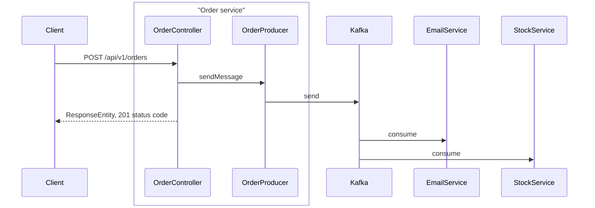

# Java Microservices 
This is still a work in progress.

## Description
Tutorial of microservices using Apache Kafka to send events from one microservice (order service)
to multiple consumers (stock service & email service)

## Technology used
- Apache Kafka
- Java 17
- Spring Boot
- Spring Web
- Lombok

### Sequence Diagram:

